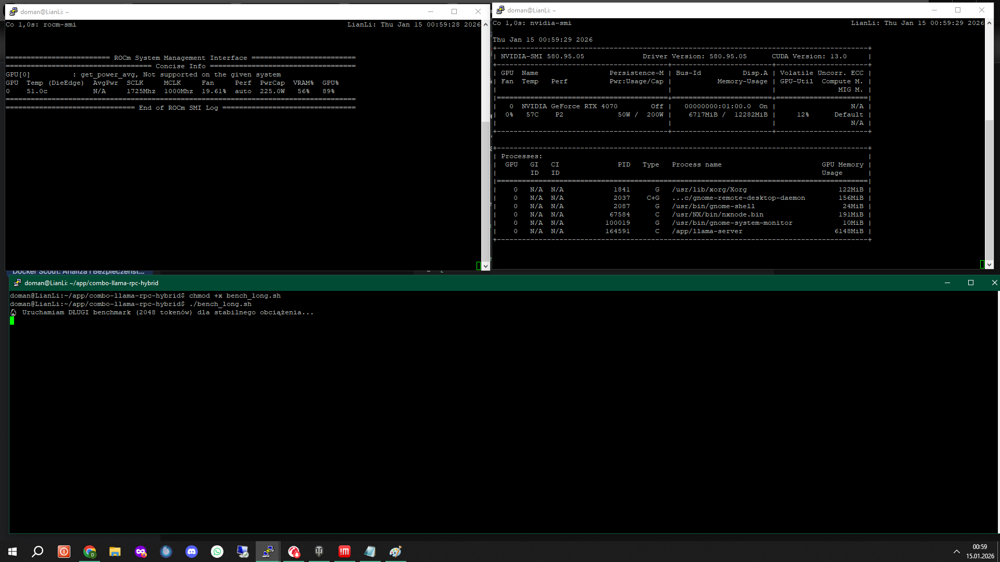

# 🚀 Combo-Llama: Hybrid NVIDIA + AMD (MI50) + Laptop VRAM Cluster

### Performance-Optimized Distributed Inference (RTX 40-Series, GFX906 & 1Gbps Ethernet)

**Combo-Llama** is a high-performance LLM cluster designed to bridge the gap between NVIDIA and AMD ecosystems. By utilizing the **llama.cpp RPC protocol**, this project aggregates the VRAM of an **NVIDIA RTX 4070 (12GB)**, a professional **AMD Instinct MI50 (32GB)** accelerator, and an additional **RTX 3050 (4GB)** mobile node into a single, cohesive compute unit with **48GB of total usable VRAM**.

---

## ⚙️ Point 0: Host & Hardware Prerequisites

* **Host Driver Stack**: Ensure **Linux Kernel KFD drivers** are installed on the host.
* **ROCm Version**: This setup is optimized and tested for **ROCm 7.1**.
* **MI50 Firmware**: Specific firmware is required to unlock the full **1725MHz SCLK** potential with stability.
* **Cooling**: Active cooling modification is **MANDATORY**. The MI50 maintains a stable **62-64°C** under **99% load** only due to the custom fan mod.
* **Docker Access**: The user must be in the `video` and `render` groups to allow container access to hardware resources.

---

## 🛠️ Hardware Compatibility Matrix

### NVIDIA (Master Node)

Pre-compiled for the **sm_89** architecture (RTX 40-series). To change the architecture for older cards (e.g., RTX 30-series), edit `Dockerfile.nvidia_master` at line `-DCMAKE_CUDA_ARCHITECTURES=89` and perform a manual rebuild.

| Generation | Architecture Code | Status |
| --- | --- | --- |
| **RTX 50-series** | `100` | Manual Rebuild |
| **RTX 40-series** | `89` | **Ready (Default)** |
| **RTX 30-series** | `86` | Manual Rebuild |
| **RTX 20-series** | `75` | Manual Rebuild |

### AMD (Worker Node)

* **Target Arch**: `gfx906` (Instinct MI50, MI60, Radeon VII).
* **Software Stack**: **ROCm 7.1** (Latest Tested).
* **Cooling**: An active cooling mod is mandatory to sustain performance at 1725MHz SCLK.

---

## 👁️ Vision-Language Capabilities (VL)

Tested with **Qwen-VL**, this cluster fully supports multimodal tasks:

* **Image Analysis**: Detailed descriptions and analysis of visual input.
* **OCR**: High-speed text extraction from documents and images.
* **Visual Reasoning**: Complex logic based on image analysis.

---

## 🏗️ Deployment Strategies (Container Structure)

### 1. "The Duo" Mode (2 Cards)

Local configuration utilizing the resources of a single workstation.

* **File**: `docker-compose.yml`.
* **Devices**: NVIDIA RTX 4070 (12GB) + AMD MI50 (32GB).
* **Total VRAM**: 44GB.

### 2. "The Trinity" Mode (3 Cards - Hybrid)

Distributed configuration featuring an additional mobile node connected via the network.

* **Files**: `docker-compose-hybrid.yml` (Master) + `docker-compose-slave.yml` (Laptop).
* **Network**: **1Gbps Ethernet (Satellite)** is required for the laptop to eliminate WiFi latency.
* **IP Configuration**: A static IP (e.g., `192.168.0.231`) is required for the Slave node (laptop) on the Ethernet interface for RPC consistency.

**Hardware Configuration for Mode 2:**

| Device | Architecture | VRAM | Role |
| --- | --- | --- | --- |
| **RTX 4070** | `sm_89` | 12GB | **Master (Ready)** |
| **RTX 3050 Laptop** | `sm_86` | 4GB | **Distributed Slave (Ethernet 1G)** |
| **Instinct MI50** | `gfx906` | 32GB | **Worker (Active Mod)** |

> **⚖️ Master Resilience Conclusion**:
> If the satellite node (laptop) is not detected at startup, the Master **will not crash**. It will log a `connect error` and automatically redistribute model layers (offloading) only to the available cards (4070 and MI50), ensuring system continuity at the cost of a smaller VRAM buffer.

---

## 🖥️ Live Hardware Utilization (Snapshot)


*Typical load during 2048 token generation:*

* **AMD MI50 (Worker)**: **~89% GPU Load** | ~18GB VRAM | SCLK 1725MHz.
* **NVIDIA 4070 (Master)**: **~12% GPU Load** | ~6.7GB VRAM | Low Power (~50W).

---

## 📊 Performance Benchmarks (Qwen3-VL-30B Q5_K_M)

Measurements certified after the implementation of the dedicated **Gigabit Ethernet** engine.

### ⚡ Context Scaling & Network Impact

| Scenario | Connection | Context | Generation Speed | Status |
| --- | --- | --- | --- | --- |
| **Clean Start** | Ethernet 1G | < 2k (Empty) | **~51.49 tok/s** | Optimal |
| **WiFi Baseline** | WiFi | < 2k (Empty) | **44.53 tok/s** | ~18% Latency |
| **Stress Test 32k** | Ethernet 1G | 32,768 tok | **~17.81 tok/s** | Stable |
| **Stability Test 64k** | Ethernet 1G | **65,536 tok** | **~12.90 tok/s** | **Cache Limit** |

### 🌐 Throughput Analysis (Extreme Stress-Test)

* **MI50 Throughput**: The MI50 virtual interface received a total of **254 GB** of data during the full test session.
* **Bridge Traffic**: Total traffic on the Docker bridge exceeded **176 GB** (128GB In / 48GB Out).
* **Stability**: Zero Timeout errors were recorded due to the transition to 1Gbps cable.

> **⚠️ 64k Test Conclusion**: Reaching the limit of 65,536 tokens triggered a controlled `request exceeds available context size` error, confirming full utilization of the configured **Cache** buffer without hardware failure.

---

## 🧠 VRAM & Context Management

| Feature | Optimized Setting | Result / Gain |
| --- | --- | --- |
| **Parallel Users** | **--parallel 1** | ~15GB VRAM Saved |
| **KV Cache Type** | **--cache-type-k/v q4_0** | 50% Cache Size Reduction |
| **Context Window** | **65,536 tokens** | Maximum Stable Buffer Limit |

---

## 🚀 Quick Start

1. **Installation**:
```bash
git clone https://github.com/xxDoman/combo-llama-rpc-hybrid.git
cd combo-llama-rpc-hybrid
mkdir guff && mv model.gguf ./guff/

```


2. **Deployment (3-Card Mode)**:
* On the Master: `docker compose -f docker-compose-hybrid.yml up -d`
* On the Laptop: `docker compose -f docker-compose-slave.yml up -d`


3. **Verification**: Check Master logs to confirm successful connections to all RPC devices on port **50052**.

---

Developed by **xxdoman** | AI Master of Disaster | **Project Status**: ✅ Fully Verified 64k Context Stability on 1Gbps Ethernet.
